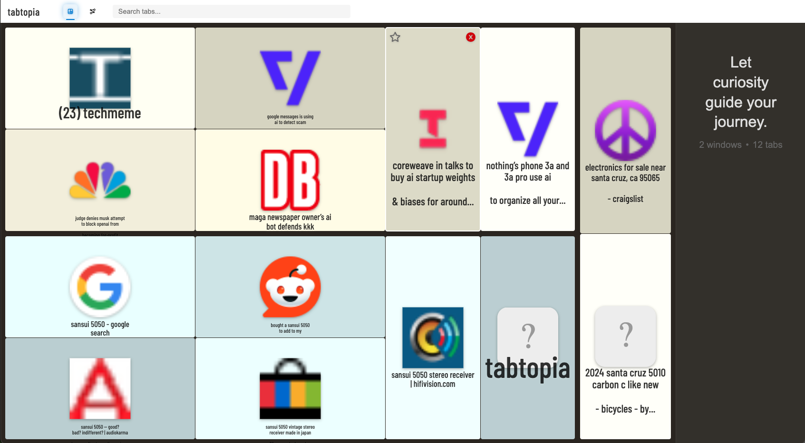
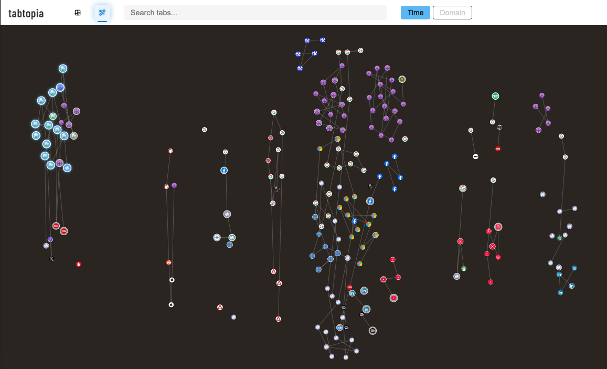

# Tabtopia

## Overview
Tabtopia is a Chrome extension that visualizes your browser history and open tabs using interactive D3.js visualizations. There are two core views -- treemap and graph.  Both support search using the excellent lunr.js library. Interestingly, the extension was largely built by AI.  

### Treemap 
The treemap allows you to find and manage tabs. You can:
* jump to a tab via double click or using keyboard nav enter/space
* close tabs
* move tabs from one window to another
* bookmark the url in a given tab
* displays recent history and bookmarks for the domain on hover/select. single-click the node to make the readout sticky and enable interaction with bookmarks and history from the domain

Additionally, keyboard navigation is supported. Use the arrow keys after selecting a node or hitting enter from the search box.

In the null state, a "motivational poster" generated by AI is displayed in the readout panel with total tabs and window counts.

### The Graph
The graph shows you recent history in one of two graphy modes: time based or domain based. This can be useful
for reflecting on your overall browsing and refinding recently visited URLs.

Use keyboard 'r' to reset the view, 't' for time view, or 'd' for domain view. 

You can also drag the graph canvas and zoom in/out with the scroll wheel. 

## Screenshots

### Treemap View

### Graph View

## Developer Installation
1. Clone this repository or download the zip
2. Open Chrome and navigate to `chrome://extensions/`
3. Enable "Developer Mode" in the top-right corner
4. Click "Load Unpacked" and select the repository folder

## Technical Details

### Architecture
- **D3.js Visualizations**: Interactive treemaps and force-directed graph layouts
- **Chrome Extension APIs**: Integration with browser history, tabs, windows, and bookmarks
- **Responsive Design**: Dynamic layout management with window resize handling

## Development Notes

This extension was developed as an exploration of browser data visualization, with significant portions of the code generated with the assistance of AI tools. The AI helped with:

- D3.js visualization implementations and layout algorithms
- Event handling and responsive design
- Chrome extension API integration
- UI component structure and styling

Anthropic and OpenAI models inside Visual Studio Code were the primary contributors, but a minority of development also occurred in Cursor with similar models. 

Human oversight, editing, and testing were applied throughout development to ensure quality, performance, and proper integration with browser APIs.

---
